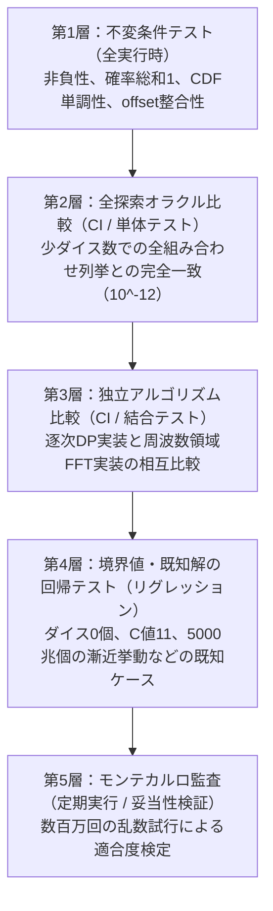

# 第17章　数値誤差と検証

本書ではここまで、ダブルクロスの判定、対決、ダメージ、バックトラック、そして各種エフェクトに至るまで、あらゆる確率分布を導出し、FFTや周波数領域解析を用いて高速に計算する手法を体系的に学んできた。

しかし、どれほど美しい数式を導出し、どれほど高速なアルゴリズムを設計したとしても、それを実装したプログラムが**「正しく動いている」**とは限らない。

数学の世界では、確率は常に $P(X=x) \ge 0$ であり、すべての確率の総和は厳密に $\sum_x P(X=x) = 1$ である。ところが、実際のコンピュータ上でプログラムを実行すると、$-2 \times 10^{-16}$ のような微小な負の確率が現れたり、総和が $0.9999999999999998$ のようにわずかに1からずれたりする。

さらに問題は浮動小数点数の丸め誤差だけにとどまらない。境界値の不等号（$<$ と $\le$）を取り違えているかもしれない。配列のインデックスが1つずれている（オフバイワンエラー）かもしれない。あるいは、高速化のために施した高度な数式変形の中に、見落とされたバグが潜んでいるかもしれない。

高速に計算できることと、正しく計算できることは、まったく別の問題である。

本書の最終章となる本章のテーマは、**「計算結果をいかにして信用するか」**である。数値誤差の正体を正しく見極め、確率分布が満たすべき不変条件を守り、全探索オラクルやモンテカルロシミュレーションを組み合わせた多層的な品質検証体系を構築する手法を学ぶ。

## 17.1 三種類の問題を区別する

プログラムが期待と異なる出力を返したとき、それをすべて「誤差のせい」と曖昧に片付けてはならない。検証を行う上では、次の3種類の問題を明確に区別して考える必要がある。

1. **数値誤差（Numerical Error）**:
   実数をIEEE 754倍精度浮動小数点数（64ビット、仮数部53ビット）で近似することによって生じる不可避な丸め誤差や桁落ち。
2. **打ち切りによる不確かさ（Truncation Bound）**:
   第13章で扱ったように、無限の台を持つ分布を有限の配列長 $w$ で打ち切った際に、未計算の領域に残された裾確率（tail確率 $T(w) \le \varepsilon$）。これは浮動小数点の丸めではなく、アルゴリズムの契約上の残差である。
3. **モデルや実装の誤り（Bug / Specification Defect）**:
   対決の同値勝敗ルールを逆に実装した、《風鳴りの爪》で小さい方からではなく大きい方から振り直してしまった、ファンブル時の達成値に技能値を足してしまったなど、プログラムの論理的な誤り。

検証の目的は、1と2を数学的に許容範囲内に封じ込めた上で、**3の実装バグを100%徹底的にあぶり出して根絶すること**にある。

## 17.2 確率分布の不変条件（Invariant）

確率論には、いかなる計算過程を経た後であっても、決して破られてはならない絶対的な数学的性質が存在する。これをソフトウェア工学における**不変条件**（Invariant）と呼ぶ。

1. **非負性（Non-negativity）**:
   すべての事象の確率は0以上でなければならない。
   $$
   \forall x, \quad P(X = x) \ge 0
   $$
2. **確率質量保存則（Conservation of Probability）**:
   取り得るすべての値の確率を足し合わせると、厳密に1（または部分分布の場合はその部分事象の確率）にならなければならない。
   $$
   \sum_{x} P(X = x) + p_{\text{overflow}} = 1
   $$
3. **累積分布関数の単調非減少性（Monotonicity）**:
   累積確率は、$x$ が増えるにつれて決して減少しない。
   $$
   x_1 \le x_2 \quad\implies\quad F(x_1) \le F(x_2)
   $$

これらの不変条件は、計算結果を検証するための最も強力な第一防衛線となる。計算の各ステップの直後にこれらの条件をアサーション（自動検査）として埋め込んでおくことで、異常を即座に検知できる。

## 17.3 微小負値のクランプと正規化

FFTや複雑な浮動小数点除算を伴う計算において、本来確率が0であるべき要素に、計算機の丸め誤差によって $-10^{-16}$ 程度の極小な負値が紛れ込むことがある。

このような微小負値を放置すると、後続の計算で対数を取った際に `NaN`（非数）が発生したり、累積確率が減少して単調性が壊れたりする。

したがって、配列処理の最終段階では、次の**クランプ（下限クリップ）と再正規化**を適用するのが標準的な実装パターンである。

```text
// 1. 微小な負値を0に補正する
for i from 0 to L-1:
    if P[i] < 0:
        if P[i] >= -1e-12: // 許容範囲内の丸め誤差なら0に潰す
            P[i] = 0.0
        else:
            raise NumericalInstabilityError("許容できない大きな負の確率が検出されました")

// 2. 確率の総和を計算し、1に正規化する
sum ← sum(P) + p_overflow
if abs(sum - 1.0) <= 1e-9:
    scale ← 1.0 / sum
    for i from 0 to L-1:
        P[i] = P[i] * scale
else:
    raise ConservationLawViolationError("確率の総和が1から大きく乖離しています")
```

ここで重要なのは、「何でもかんでも0にして合計を1に無理やり合わせればよい」わけではないという点である。もし生じた負値が $-0.05$ のように大きかったり、総和が $1.15$ のように1から著しく乖離していたりするなら、それは浮動小数点の丸め誤差ではなく**明確な実装バグ**である。許容誤差の範囲内か否かを厳格にしきい値で判定することが肝要である。

### 絶対誤差と相対誤差の使い分け
計算値 $\hat{x}$ と真値 $x$ のズレを評価する際、**絶対誤差** $|\hat{x} - x|$ と**相対誤差** $|\hat{x} - x| / |x|$ のどちらを基準にすべきだろうか。

確率分布の検証においては、**絶対誤差を基準とするのが最も安全かつ実用的**である。
なぜなら、真の確率が0である事象に対して微小ノイズ $\hat{p} = 10^{-16}$ が出た場合、真値が0であるため相対誤差は定義できない。また、裾確率のように真値が $10^{-20}$ である箇所で計算値が $2 \times 10^{-20}$ になった場合、相対誤差は100%に達してしまうが、確率質量としての絶対誤差はわずか $10^{-20}$ にすぎず、全体の確率計算に与える影響は完全にゼロとみなせる。裾野の微小確率において相対誤差に過剰に囚われると、実用上の意味を失ったテスト失敗に悩まされることになる。

## 17.4 実装を自分自身で検証しない（独立オラクルによる検証）

高速アルゴリズム（FFTや周波数領域一括評価）を実装したとき、最も陥りやすい過ちは「その高速な実装自身が出力した結果を見て、合っていそうだと思ってしまう」ことである。

複雑な最適化コードの正しさを証明するためには、**「最適化を一切行わない、愚直で単純な別の実装（オラクル / Oracle）」を用意し、同一の入力に対して両者の出力が完全に一致するかを比較する**以外に道はない。

### 小ケースの全探索（ブルートフォース・オラクル）

オラクルは高速である必要はまったくない。たとえばダイス数が $2\sim4$ 個程度の小さなケースであれば、すべての出目の組み合わせ（$10^2 = 100$ 通り〜$10^4 = 10,000$ 通り）を多重ループで力技で全列挙し、紙の上でルールを解くのとまったく同じ手順で確率を数え上げることができる。

```text
【テストの構造】
                 ┌───> [ 愚直な全探索オラクル（100%正しい）] ───> 正解分布 P_exact
    入力パラメータ ─┤
                 └───> [ 超高速な周波数領域実装（FFT）] ────────> 計算分布 P_fast
                                                                     │
                                         [ 誤差評価: |P_exact - P_fast| < ε ] ──> 合格！
```

どれほど高度なFFTや正規化導関数のアルゴリズムであっても、ダイス数3個や4個の小さな入力において全列挙オラクルと $10^{-12}$ の精度で完全に一致しなければ、そのアルゴリズムは絶対に間違っている。

## 17.5 モンテカルロシミュレーションによる独立検証

全探索オラクルはダイス数が小さい領域（$n \le 5$）では無敵の検証手段だが、ダイス数が20個や50個に達すると、組み合わせ爆発によって全列挙は不可能になる。

そこで登場するのが、乱数を用いてゲームの試行を数百万回〜数億回シミュレーションする**モンテカルロ法**（Monte Carlo Method）である。

ルールブックの記述通りにダイスを振ってクリティカルを判定し、エフェクトを適用してダメージを記録するシミュレータを作成する。これは数理モデルや母関数の理論を一切経由しないため、**数式そのもののモデル化ミスを検出するための完全に独立した検証系**となる。

### シミュレーション検証における注意点

モンテカルロシミュレーションを用いる際、知っておくべき統計学の鉄則がある。

* **収束速度は $1/\sqrt{N}$**:
  試行回数を $N$ 回としたとき、モンテカルロシミュレーションの統計誤差（標準偏差）はおよそ $1/\sqrt{N}$ に比例してしか小さくならない。試行回数を100万回（$10^6$）振っても、統計的な誤差は $1/\sqrt{10^6} = 10^{-3}$（約0.1%）程度残る。
* **確率の完全一致は期待できない**:
  シミュレーション結果と理論値が一致しないからといって、試行回数を無闇に増やして力技で押し通そうとしてはならない。仮説検定（カイ二乗適合度検定やKolmogorov-Smirnov検定）を用い、「観測されたズレが標本変動として統計的に許容される有意水準内にあるか」を判定しなければならない。

## 17.6 回帰比較と独立検証の役割分担

既存のシステムや以前のバージョンとの比較テスト（回帰テスト / リグレッションテスト）も実務上極めて重要である。以前のコードベースが出力したゴールデンデータ（正解JSON）と比較することで、リファクタリングによって意図しない変更が生じていないかを瞬時に検知できる。

しかし、次の点には常に自覚的でなければならない。

$$
\boxed{
\text{以前の出力と同一であること} \;\neq\; \text{ルールブック上正しいこと}
}
$$

もし以前の実装が潜在的なバグ（たとえば対決時の同値処理の誤りなど）を含んでいた場合、新しい実装がそれと完全に一致してしまえば、バグを正しく再現してしまっているにすぎない。
- **回帰比較（Regression Testing）**: リファクタリングによる予期せぬ破壊やデグレードを防ぐ。
- **独立検証（Independent Verification）**: 数学モデルやルール解釈そのものが真実であるかを証明する。

この2つを明確に区別し、両輪として回すことが不可欠である。

## 17.7 許容誤差の設計思想

浮動小数点演算を検証する際、判定閾値 $\varepsilon$ をいくつに設定すべきだろうか。「テストが落ちるから」という理由で、安易に許容誤差を $10^{-3}$ や $0.05$ のように緩めてはならない。

許容誤差とは、
> **「テストを無理やりパスさせるための妥協値」ではなく、「正常な数値丸めノイズと、重大な実装バグを厳密に切り分けるための境界線」**
でなければならない。

正常な倍精度演算における丸め誤差の蓄積が $10^{-15} \sim 10^{-14}$ 程度であるならば、許容誤差は $10^{-12}$ や $10^{-10}$ 付近に設定するのが極めて合理的である。これならば、丸めノイズは余裕を持って通過しつつ、境界のオフバイワンや足し忘れといった「$10^{-2}$ オーダーの真のバグ」は確実に検知できる。

## 17.8 多層的な品質保証体系

真に信頼できる確率計算エンジンを構築するためには、単一のテスト手法に頼るのではなく、異なる役割を持つ検証手段を何層にも重ねる**多層防御テスト**（Multi-tiered Testing）が不可欠である。



この5層のテストをすべてパスして初めて、計算器の出力する数値は「数学的に真であり、工学的に堅牢である」と胸を張って保証できる。

## 17.9 本書全体のまとめ

本書は、TRPG『ダブルクロス The 3rd Edition』のダイス計算を題材として、離散確率論と計算機アルゴリズムの世界を旅してきた。

ここで、本書が歩んできた道のりを振り返ろう。

1. **第I部（基礎）**: ダイスの出目を**確率変数**として捉え、和の分布を**畳み込み**と**動的計画法**で解く道具を手に入れた。
2. **第II部（基本ルール）**: クリティカルの連鎖を**幾何分布**と**最大値分布 $F(x)^n$** で一撃で解き、達成値、対決、ダメージ混合、そしてバックトラックによる生還判定まで、基本戦闘サイクルを一筆書きでモデル化した。
3. **第III部（特殊効果）**: 《妖精の手》《支配の領域》《風鳴りの爪》《屍人》といった多彩なエフェクトに対し、**順序統計量**や**上限付きダイス和DP**を駆使して、複雑なゲームルールを美しい独立事象へと解体した。
4. **第IV部（有限表現）**: 無限の台を持つ分布をコンピュータに載せるため、**オフセット付き配列表現**と、**許容誤差 $\varepsilon$ による計算範囲の逆算**という工学的基盤を確立した。
5. **第V部（高速化と検証）**: 確率母関数という代数の架け橋を渡り、**高速フーリエ変換（FFT）**と**周波数領域一括評価**によって極限の高速計算を達成し、最後に**多層的な品質検証体系**によってその正しさを証明した。

「ダイスを振って楽しむ」というゲームの純粋な遊びの背後には、驚くほど深遠で美しい数学と、それを現実の速度で動かすための計算機科学の知恵が息づいている。

本書を最後まで読み終えた読者は、すでに任意のプログラミング言語を用いて、世界最速水準のダブルクロス確率計算エンジンを自らの手で実装できるだけの力を持っているはずである。

本書が、確率論とアルゴリズムの面白さを実感し、実践的なソフトウェア工学へと踏み出す確かな足がかりとなれば幸いである。

